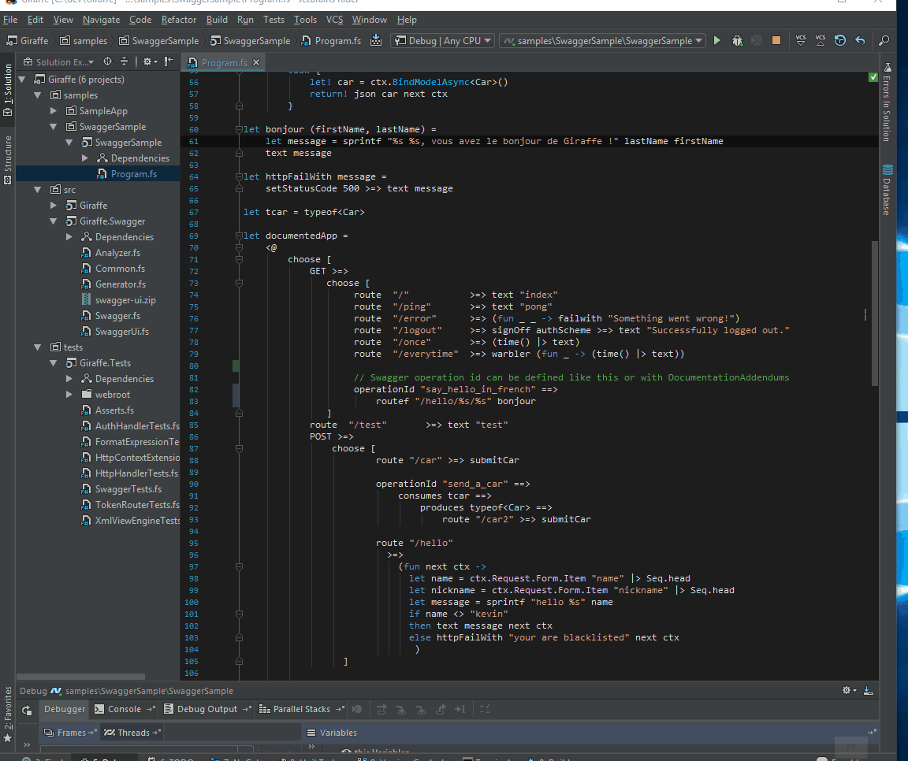

# SwaggerForFsharp

Swagger for F# project is destinated to produce libraries generating Swagger's documentation with REST frameworks like Giraffe and Suave.

__This project needs feedbacks and is not really production ready.__

## Swagger for Giraffe

### NuGet

Waiting maturity I only published the library on my feed MyGet.


You can use NuGet to install the library:

https://www.myget.org/feed/romcyber/package/nuget/SwaggerForFsharp.Giraffe

### History

In this project I propose a solution to generate a swagger for Giraffe. 
Issue https://github.com/giraffe-fsharp/Giraffe/issues/79 has label `help wanted` 😃  .
Contributing direclty to Giraffe seems to be less reactive than creating my own project (see [PR #218](https://github.com/giraffe-fsharp/Giraffe/pull/218) )

[My solution for Suave](https://rflechner.github.io/Suave.Swagger/) was effectively not really easy to use.
Documentation and service implementation were too strongly coupled and the DSL was really verbose.

The good news is that we still have to declare our API routes the same way as before but to enable the route analysis we have to surround the app declaration with quotation marks.

With that in place we can decouple the app declaration from the analysis required to generate the swagger documentation. In other words this solution has the avantage to avoid corrupting your service implementation.


### Getting started

#### Create the project

You can create your project with following steps.

```shell
dotnet new console --lang F#
dotnet add package SwaggerForFsharp.Giraffe --version 1.0.0-CI00004 --source https://www.myget.org/F/romcyber/api/v3/index.json
```

Open your `.fsproj` and edit your package references.

You should have something like:

```xml
<Project Sdk="Microsoft.NET.Sdk">

  <PropertyGroup>
    <OutputType>Exe</OutputType>
    <TargetFramework>netcoreapp2.0</TargetFramework>
  </PropertyGroup>

  <ItemGroup>
    <Compile Include="Program.fs" />
  </ItemGroup>

  <ItemGroup>
    <PackageReference Include="FSharp.Core" Version="4.5.*" />
    <PackageReference Include="Giraffe" Version="1.1.0" />
    <PackageReference Include="Microsoft.AspNetCore.Http.Abstractions" Version="2.1.1" />
    <PackageReference Include="SwaggerForFsharp.Giraffe" Version="1.0.0-CI00004" />
    <PackageReference Include="Microsoft.AspNetCore.All" Version="2.0.*" />
    <PackageReference Include="TaskBuilder.fs" Version="2.0.0" />
  </ItemGroup>

</Project>
```

#### Code

Edit `Program.fs`

```FSharp
module SwaggerGiraffeTesting.App


open System
open System.IO
open Microsoft.AspNetCore
open Microsoft.AspNetCore.Builder
open Microsoft.AspNetCore.Hosting
open Microsoft.AspNetCore.Http
open Microsoft.AspNetCore.Authentication.Cookies
open Microsoft.Extensions.Logging
open Microsoft.Extensions.DependencyInjection
open Giraffe
open SwaggerForFsharp.Giraffe
open SwaggerForFsharp.Giraffe.Common
open SwaggerForFsharp.Giraffe.Generator
open SwaggerForFsharp.Giraffe.Dsl

let errorHandler (ex : Exception) (logger : ILogger) =
    logger.LogError(EventId(), ex, "An unhandled exception has occurred while executing the request.")
    clearResponse >=> setStatusCode 500 >=> text ex.Message
let authScheme = CookieAuthenticationDefaults.AuthenticationScheme
let time() = System.DateTime.Now.ToString()
let bonjour (firstName, lastName) =
    let message = sprintf "%s %s, vous avez le bonjour de Giraffe !" lastName firstName
    text message

let httpFailWith message =
    setStatusCode 500 >=> text message

let docAddendums =
    fun (route:Analyzer.RouteInfos) (path:string,verb:HttpVerb,pathDef:PathDefinition) ->
    
        // routef params are automatically added to swagger, but you can customize their names like this 
        let changeParamName oldName newName (parameters:ParamDefinition list) =
            parameters |> Seq.find (fun p -> p.Name = oldName) |> fun p -> { p with Name = newName }
    
        match path,verb,pathDef with
        | _,_, def when def.OperationId = "say_hello_in_french" ->
            let firstname = def.Parameters |> changeParamName "arg0" "Firstname"
            let lastname = def.Parameters |> changeParamName "arg1" "Lastname"
            "/hello/{Firstname}/{Lastname}", verb, { def with Parameters = [firstname; lastname] }
        | _ -> path,verb,pathDef
let port = 5000

let docsConfig c = 
    let describeWith desc = 
        { desc
            with
                Title="Sample 1"
                Description="Create a swagger with Giraffe"
                TermsOfService="Coucou"
        } 
    
    { c with 
        Description = describeWith
        Host = sprintf "localhost:%d" port
        DocumentationAddendums = docAddendums
    }

let webApp =
    swaggerOf
        ( choose [
              GET >=>
                 choose [
                      route  "/"           >=> text "index" 
                      route  "/ping"       >=> text "pong"
                      // Swagger operation id can be defined like this or with DocumentationAddendums
                      operationId "say_hello_in_french" ==> 
                          routef "/hello/%s/%s" bonjour
                 ]
              RequestErrors.notFound (text "Not Found") ]
       ) |> withConfig docsConfig

// ---------------------------------
// Main
// ---------------------------------

let cookieAuth (o : CookieAuthenticationOptions) =
    do
        o.Cookie.HttpOnly     <- true
        o.Cookie.SecurePolicy <- CookieSecurePolicy.SameAsRequest
        o.SlidingExpiration   <- true
        o.ExpireTimeSpan      <- TimeSpan.FromDays 7.0

let configureApp (app : IApplicationBuilder) =
    
    app.UseGiraffeErrorHandler(errorHandler)
       .UseStaticFiles()
       .UseAuthentication()
       .UseGiraffe webApp

let configureServices (services : IServiceCollection) =
    services
        .AddGiraffe()
        .AddAuthentication(authScheme)
        .AddCookie(cookieAuth)   |> ignore
    services.AddDataProtection() |> ignore
    
let configureLogging (loggerBuilder : ILoggingBuilder) =
    loggerBuilder.AddFilter(fun lvl -> lvl.Equals LogLevel.Error)
                 .AddConsole()
                 .AddDebug() |> ignore

[<EntryPoint>]
let main _ =
    let contentRoot = Directory.GetCurrentDirectory()
    let webRoot     = Path.Combine(contentRoot, "WebRoot")
    let url = sprintf "http://+:%d" port
    
    WebHost.CreateDefaultBuilder()
        .UseUrls(url)
        .UseWebRoot(webRoot)
        .Configure(Action<IApplicationBuilder> configureApp)
        .ConfigureServices(configureServices)
        .ConfigureLogging(configureLogging)
        .Build()
        .Run()
    0
```

#### Build and run

Run with

```shell
dotnet build
dotnet run
```

Go to url http://localhost:5000/swaggerui/index.html

### How does it work ?

I introduced the `documents` function that takes two arguments:
1. the quotation expression containing webservice implementation.
2. a `DocumentationConfig` argument.

This function does the analysis of your quotation to generate Swagger documentation.

`DocumentationConfig` contains the following properties:

- `MethodCallRules`: allow you to provide custom functions to enrich DSL and / or quotation analysis.
- `DocumentationAddendums`: allow you to add more informations to the documentation without introducing service implementation modification.

I introduced `==>` operator that gives the possibility to add `decorations` in routes implementations.

### Examples

There are 2 solutions to add documentation for a route.

[See example](./src/samples/SwaggerForFsharp.Giraffe.Sample/Program.fs)

- [First one](./src/samples/SwaggerForFsharp.Giraffe.Sample/Program.fs#L183)

```fsharp
...
operationId "send_a_car" ==>
	consumes tcar ==>
		produces typeof<Car> ==>
			route "/car2" >=> submitCar
...
```

- [Second one](./src/samples/SwaggerForFsharp.Giraffe.Sample/Program.fs#L181)

using `DocumentationAddendums`

```fsharp
...
route "/car" >=> submitCar
...

let docAddendums =
    fun (route:Analyzer.RouteInfos) (path:string,verb:HttpVerb,pathDef:PathDefinition) ->
        match path,verb,pathDef with
        | "/car", HttpVerb.Post,def ->
            let ndef = 
                (def.AddConsume "model" "application/json" Body typeof<Car>)
                    .AddResponse 200 "application/json" "A car" typeof<Car>
            path, verb, ndef
...
```

### Next steps

#### SwaggerUi

In futur, SwaggerUi could be a submodule of the repository (if you like and accept this PR 😄  ).

#### Quotations and Giraffe

Some features could be missing and some quotations could be difficult to parse.
For the moment, analyzer works with most basics [default httphandlers](https://github.com/giraffe-fsharp/Giraffe#default-httphandlers).

I only implemented:

- GET
- POST
- PUT
- PATCH
- DELETE
- route
- routeCi
- routef
- setStatusCode
- text
- json
- choose
- subRouteCi
- subRoute

You can build and run [SwaggerSample/Program.fs](./src/samples/SwaggerForFsharp.Giraffe.Sample/Program.fs) and 
 go to http://localhost:5000/swaggerui/



#### Suave

Next step will consist to add genericity and implement a version for Suave.io

